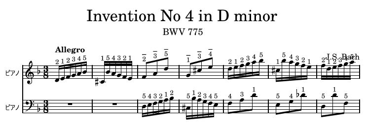

# survey_piano_fingering

## 背景

- 手の大きさ、稼働域といった個人差
- 演奏するテンポや、フレーズに対するふさわしさ
- １音符内での替え指、１指で２音以上を弾く（必ずしも音符と指番号が１対１ではない）
- ブレス、アーティキュレーションなどの表現（必ずしも弾きやすい指で弾くわけではない）
- ペダリング、音長の省略といった補助
- 曲の時代背景（古典運指など）
- ミニ鍵盤など鍵盤の大きさによる違い

## pianoplayer

pianoplayerでの生成例



## Reference repositories

https://github.com/serenado/PianoFingeringProject
> implements a more efficient algorithm that forgos "chunks" completely and uses dynamic programming on individual notes instead.

> The new algorithm also incorporates hand resets when there is a long enough rest between notes and also a long enough distance (> 7 half steps). In the future, a more complex method could be implemented to determine when hand resets should occur.

https://github.com/marcomusy/pianoplayer

指同士の距離をスケールすることで手の大きさに対してアプローチがある
```
self.hf = utils.handSizeFactor(size)
if self.frest[i]: self.frest[i] *= self.hf
```
指への重み付け、黒鍵の押しやすさといった少ないパラメータから計算している

https://github.com/Guwalgiya/Piano-Fingering-Generators

ルールベース、LSTMなど複数の手法の実装例

https://github.com/maxhirsch/Piano-Fingering-Prediction

RNNによる実装例

https://github.com/mpg/pypiano-fingers

https://github.com/blakewest/performer

https://github.com/dvdrndlph/pydactyl

## Datasets

PIG Dataset
https://beam.kisarazu.ac.jp/~saito/research/PianoFingeringDataset/index-ja.html

> PIG データセッ
トは西洋クラシック作曲家のピアノ曲から成り，ピアノ演
奏者により付けられた運指が含まれている．現在，150 曲
の楽曲が収められており，各楽曲には一つあるいは複数の
運指が与えられている．なるべく多様なスタイルの音楽を
含めるため，少量の楽曲の全曲に対して運指を付けるので
はなく，多くの曲の一部分に対して運指のラベル付けを
してある．運指付けされた部分の典型的な長さは，楽譜 1
ページ程度で，小節数は約 20，音符数は約 300 である．

> 一部の楽曲には，個人性を調べるために最低 4 人の異なる
ピアノ演奏者による運指が与えられている．

> PIG データセットの運指は音楽大学ピアノ学科の卒業生
あるいは 20 年以上のピアノ演奏経験を持つピアノ熟練者
により与えられたものである．

MAESTRO
http://createwith.ai/dataset/20181106/1358

> インターネット上のピアノ演奏コンペティション International Piano-e-Competition でのピアニストの演奏を集めることで作成されており...演奏数1,184，曲数430 ものデータが用意されており，ピアノ演奏のデータセットとしては現時点で最大規模のデータセット

## music xml

http://roomba.hatenablog.com/entry/2016/02/03/150354

## music21

https://github.com/cuthbertLab/music21/issues/137

https://ameblo.jp/delphinus1024/entry-12365205195.html

https://miso-soup3.hateblo.jp/entry/2018/12/20/223705

https://naraba.hatenablog.com/entry/20121201/p1

## 参考

### ソフトウェア

ピアノマスターdp
https://cm.kawai.jp/products/pmdp/

運指レッスン フィンガリ‪ン‬
https://apps.apple.com/jp/app/%E9%81%8B%E6%8C%87%E3%83%AC%E3%83%83%E3%82%B9%E3%83%B3-%E3%83%95%E3%82%A3%E3%83%B3%E3%82%AC%E3%83%AA%E3%83%B3/id942390847

### アニメーション生成

https://www.vice.com/en/article/v7m8xd/watch-these-ai-hands-attempt-to-play-an-unplayable-song-on-the-piano

https://qiita.com/yamatohkd/items/0f5b9b031ec0976d872a

### 録画

https://sairie.com/movie-sp/

https://pf.classicmusic.tokyo/rec/

https://seminar.piano.or.jp/news/2020/06/entry_265.html